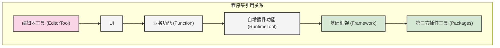

# Game-Project-Structure

游戏项目目录结构示例，采用模块化、分层设计理念，确保代码的可维护性和可复用性。

## 项目设计理念

本项目结构设计遵循以下原则：
- **模块化**：将代码按功能模块划分，便于团队协作和代码管理
- **分层架构**：建立清晰的依赖关系，确保代码的可维护性
- **可复用性**：核心功能和工具设计为可跨项目复用
- **引用规则**：只能上引用下，同层内依功能关系处理引用

## 目录结构说明

### 核心目录

1. **Framework** - 基础框架代码
   - 定位：换项目依旧可以使用的核心框架代码
   - 职责：提供基础架构、通用工具类、核心系统等

2. **Function** - 业务功能代码
   - 定位：换了引擎或UI表现依旧可以使用的业务逻辑
   - 职责：实现具体业务功能，如用户管理、经济系统、成就系统、任务系统等

3. **EditorTool** - 编辑器效率工具代码
   - 定位：换了项目依旧可以使用的编辑器工具
   - 职责：资源的自动化处理、快速创建字体资源、网络环境配置等

4. **RuntimeTool** - 插件性功能代码
   - 定位：换了项目依旧可以使用的运行时工具
   - 职责：自定义扩展的UI控件、UI特效、红点管理系统、访问非Unity文件路径等

5. **UI** - 用户界面代码
   - 定位：游戏的用户界面实现
   - 职责：处理游戏中的界面展示、交互逻辑等

6. **Packages** - 第三方插件工具
   - 定位：项目使用的第三方库和插件
   - 职责：提供外部依赖功能

7. **Resources** - 资源文件
   - 定位：游戏中的各种资源
   - 职责：存储模型、材质、音效、UI资源等

## 文件结构图

```
Game-Project-Structure/
├── Assets/
│   ├── Plugins/
│   ├── Resources/
│   │   ├── Develop/
│   │   ├── Release/
│   │   │   ├── SampleEntityXXX/
│   │   │   │   ├── Common/
│   │   │   │   │   ├── Anime/
│   │   │   │   │   ├── Audio/
│   │   │   │   │   └── Config/
│   │   │   │   └── SampleIndividualXXX/
│   │   │   │       ├── Anime/
│   │   │   │       ├── Audio/
│   │   │   │       ├── Image/
│   │   │   │       ├── Material/
│   │   │   │       └── Prefab/
│   │   │   └── UI/
│   │   │       ├── Common/
│   │   │       │   ├── Anime/
│   │   │       │   ├── Audio/
│   │   │       │   └── Config/
│   │   │       └── SampleSceneXXX/
│   │   │           ├── Config/
│   │   │           └── Panel/
│   │   │               └── PnlXXX/
│   ├── Scripts/
│   │   ├── EditorTool/
│   │   │   └── SampleXXX/
│   │   │       └── Editor/
│   │   ├── Framework/
│   │   │   └── SampleXXX/
│   │   │       ├── Editor/
│   │   │       └── Runtime/
│   │   ├── Function/
│   │   │   └── SampleXXX/
│   │   │       ├── Editor/
│   │   │       └── Runtime/
│   │   │           ├── AccessBus/
│   │   │           ├── Config/
│   │   │           ├── Data/
│   │   │           ├── GlobalListener/
│   │   │           ├── LuaPlugin~/
│   │   │           ├── Prewarm/
│   │   │           ├── Save/
│   │   │           ├── Server/
│   │   │           ├── Service/
│   │   │           └── XXXManager.cs
│   │   ├── RuntimeTool/
│   │   │   └── SampleXXX/
│   │   │       ├── Editor/
│   │   │       └── Runtime/
│   │   └── UI/
│   │       └── SampleSceneXXX/
│   │           ├── Config/
│   │           ├── Input/
│   │           ├── Panel/
│   │           │   └── PnlXXX/
│   │           └── XXXJumpManager.cs
├── Packages/
├── .gitignore
└── README.md
```

## 程序集引用关系图



### 引用规则

- **只能上引用下**：上层模块可以引用下层模块，下层模块不能引用上层模块
- **同层内依功能关系处理引用**：同一层级的模块之间根据功能依赖关系处理引用

## 如何使用本项目结构

1. **基础框架搭建**：在Framework目录下实现核心框架功能
2. **工具类开发**：在EditorTool和RuntimeTool目录下开发通用工具
3. **业务逻辑实现**：在Function目录下实现具体业务功能
4. **UI开发**：在UI目录下实现用户界面
5. **资源管理**：在Resources目录下组织游戏资源
6. **第三方依赖**：在Packages目录下管理第三方插件